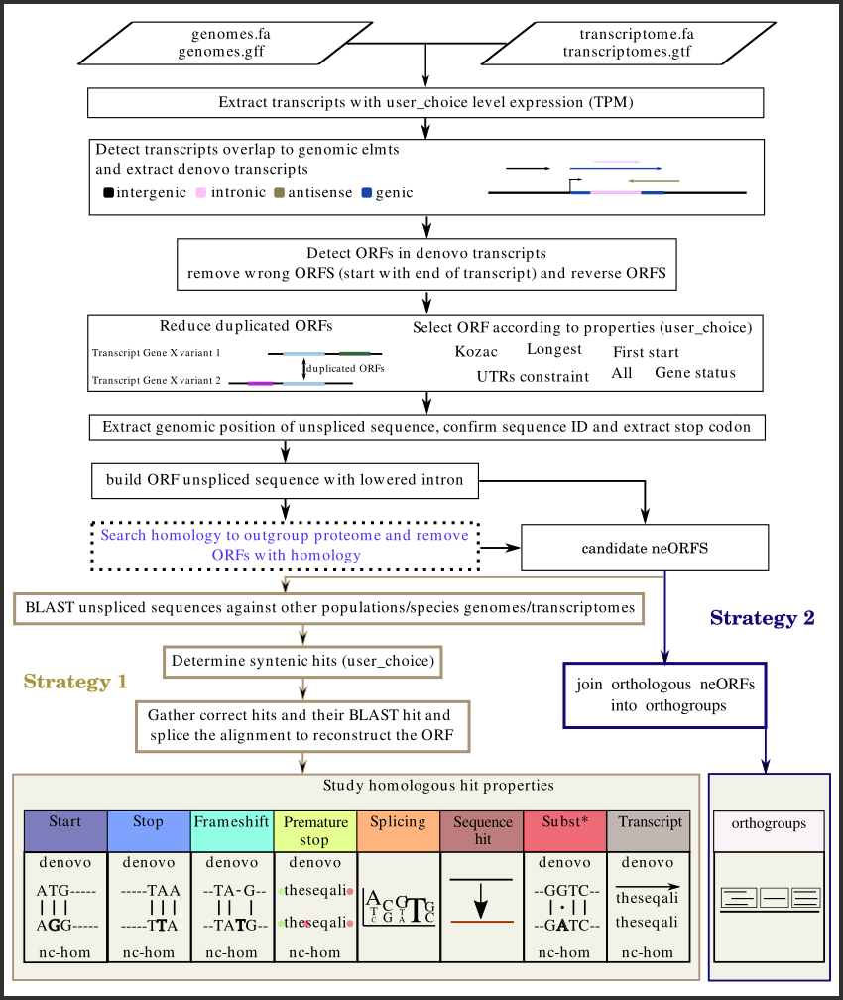

# Introduction
> [!IMPORTANT]
**DESMAN** is being benchmarked and corrected. Please wait for the publication and for the correct structuring of the code before using it.  

**DESMAN** is a software that detect neORFs (precursors of _de novo_ genes), based on transcriptome data, and study their mutations within populations and/or species. 

**DESMAN** DESMAN (De novo Emergence, Shared Mutations, And Nucleotides), a software tool designed to: (1) detect neORF candidates in transcriptomes, (2) validate the absence of homology to any known gene, and (3) search for syntenic homologous sequences in outgroup genomes (+ optionaly transcriptomes) and analyzing coding mutations between homologs. DESMAN is available as a user-friendly graphical user interface, offering users a high degree of flexibility with various options. \\
Regardless of its flexibility, **DESMAN** can operate under two distinct strategies.

- **Strategy 1** : With strategy 1, the user has in possession : 1 transcriptome assembled with 1 reference genome and several outgroup genomes (optional, corresponding transcriptomes). The user has assembled a transcriptome by mapping stranded RNA-seq data to a reference genome and wishes to determine whether such a transcriptome contains newly expressed ORFs. Furthermore, the user aims to detect if such \textit{de novo} genes candidates for can be found in outgroup genomes and to what extent they are conserved.

- **Strategy 2** : With strategy 2, the user has in possession : several transcriptomes assembled with one reference genome. The user has sequenced multiple RNA-seq datasets from the same species, such as RNA-seq data from different organs or conditions, and assembled each transcriptome based on a single reference genome. With strategy 2, the user wishes to extract all candidate \textit{de novo} genes from each transcriptome. In a second step, the user aims to study which of the candidates are transcribed under different conditions.
