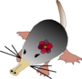

# DESwoMAN



# Introduction
> [!IMPORTANT]
**DESwoMAN** is being benchmarked and corrected. Please wait for the publication and for the correct structuring of the code before using it.  

**DESwoMAN** (De novo Emergence, Shared Mutations, And Nucleotides) is a software that detect neORFs (precursors of _de novo_ genes), based on transcriptome data, and study their mutations within populations and/or species. 

# Usage

**DESwoMAN** (*De novo* Emergence Study With Outgroup MutAtioNs), performs runs with 3 main steps: 
- (1) detect neORF candidates in transcriptomes,
- (2) validate the absence of homology to any known gene
- (3) search for syntenic homologous sequences in outgroup genomes (+ optionaly transcriptomes) and analyzing coding mutations between homologs.

**DESwoMAN** is available as a user-friendly graphical user interface, offering users a high degree of flexibility with various options. Regardless of its flexibility, **DESwoMAN** can operate under two distinct strategies.

**$${\color{orange}Strategy 1 : \space}$$** \
The user possesses: 1 transcriptome assembled with a reference genome and several optional outgroup genomes (with corresponding transcriptomes, if available). The transcriptome has been assembled by mapping stranded RNA-seq data to the reference genome, and the user aims to determine whether this transcriptome contains neORFs. Additionally, the user seeks to detect whether these neORF candidates can be found in the outgroup genomes and to what extent they are conserved. 

For example, let's consider a user who sequenced RNA from *Drosophila melanogaster* and assembled a transcriptome by mapping the RNA-seq data to the *D. melanogaster* reference genome. Using Strategy 1, the user will: 
* Extract all putative neORFs from the transcriptome.
* Select neORFs that show no homology to known proteins in Drosophila and, optionally, in outgroup species.
* Search for syntenic homologous sequences in outgroup genomes (either from *D. melanogaster* or from outgroup species) and analyze the mutations between the neORFs and their syntenic homologous sequences to study de novo emergence. 

**$${\color{orange}Strategy 2 : \space}$$** \
The user possesses several transcriptomes assembled with a single reference genome. The user has sequenced multiple RNA-seq datasets (for example, RNA-seq data from different organs or conditions of one species), and the transcriptomes were assembled by mapping the RNA-seq data to the same reference genome. With Strategy 2, the user aims to extract all candidate neORFs from each transcriptome. In the second step, the user seeks to identify which candidates are detected across multiple transcriptomes, and, for example, transcribed under different conditions. 

For example, let's say a user sequenced RNA-seq data from six different *D. melanogaster* samples, each extracted under different conditions, and assembled six different transcriptomes by mapping the RNA to the *D. melanogaster* reference genome. Using Strategy 2, the user will:: 
* Extract all putative neORFs from the transcriptome.
* Select neORFs that show no homology to known proteins in Drosophila and, optionally, in outgroup species.
* Determine which neORFs are expressed across multiple transcriptomes.

> [!NOTE]
A manual is available to access more precisely all steps made by **DESwoMAN**

# Flowchart


# Install DESwoMAN

The is 2 main strategy to run DESwoMAN : 
* Install manually DESwoMAN dependencies on your computer before running DESwoMAN
* Use the container where everything is set-up
> [!WARNING]
> DESwoMAN runs only under linux or OS distributions

> [!IMPORTANT]
> We encourage users to work with the container (**Option 2**)

## Option 1. Install manually

DESwoMAN requires the installation of the following softwares
* BLAST (v2.12 or +) 
* DIAMOND (v2.0.14.152 or +) 
* GffRead (v0.12.7 or +) 


Moreover, DESwoMAN is developped in python (v3.0 or +). It therefore requires to have python installed, with the following packages:

* Biopython (vs 1.83) 
* customtkinter (5.2.2) 

### 1. Install [BLAST](https://www.ncbi.nlm.nih.gov/books/NBK569861/) (linux)

```console
user@comp:~/directory$ rpm -ivh ncbi-blast-2.2.18-1.x86\_64.rpm
```

### 2. Install [DIAMOND](https://github.com/bbuchfink/diamond/wiki) (linux)

```console
user@comp:~/directory$ wget http://github.com/bbuchfink/diamond/releases/download/v2.1.9/diamond-linux64.tar.gz
user@comp:~/directory$ tar xzf diamond-linux64.tar.gz
```


### 3. Install [GffRead](https://github.com/gpertea/gffread) (linux)

```console
user@comp:~/directory$ cd /some/build/dir
user@comp:~/directory$ git clone https://github.com/gpertea/
user@comp:~/directory$ gffread
user@comp:~/directory$ cd gffread
user@comp:~/directory$ make release
```

### 4. Install [biopython](https://biopython.org/wiki/Download) (linux)

```console
user@comp:~/directory$ pip install biopython
```

### 5. Install [customTkinter](https://pypi.org/project/customtkinter/0.3/) (linux)

```console
user@comp:~/directory$ sudo apt-get install python3-tk
user@comp:~/directory$ pip install customtkinter==0.3
```

## Option 2. Use the container


# Run **DESwoMAN**

**DESwoMAN** runs with python3. To run **DESwoMAN**, the user must call DESwoMAN.py, followed by the chosen Strategy. The strategies must be either **Strategy1** or **Strategy2**
By default, **DESwoMAN** runs with a GUI. However, the user can specify a configuration file. To do so, the path to the configuration file must be provided in the command line after the strategy.

## With GUI

```console
user@comp:~/directory$ python3 DESwoMAN.py Strategy1
```

## With configuration file

```console
user@comp:~/directory$ python3 DESwoMAN.py Strategy1 param.config
```

# **DESwoMAN** Setup the entry

If **DESwoMAN** is launched with the graphical interface, the user can configure all parameters through the GUI. Alternatively, the user can use a configuration file.
In this configuration file, all options are set by default. If DESwoMAN is run with default options, only the three mandatory parameters—**query**, **path_to_genome_repository**, and **path_to_transcriptome_repository**—are required to remain in the config file.
Additionally, all parameters from Part 3 are specific to Strategy1. They can be included in the file when using Strategy2, but they will be ignored.

## Configuration file (param.config)

```console
#Part 1
query = name // name of the query genome MANDATORY
path_to_genome_repository = path // path to genome repository MANDATORY
path_to_transcriptome_repository = path // path to transcriptome repository MANDATORY
TPM_threeshold = 0.5 // float. Default : 0.5
transcript_overlap = intronic, genic  // allowed genomic overlap, separated by a comma. Default : intergenic
ORFs_choice = longest // ORF choice (string). Default : longest
five_prime = 0 // minimum length of 5'UTR (int). Default : 0
three_prime = 0 // minimum length of 3'UTR (integer). Default : 0
filter_genic = False // filter genic transcripts (bolean). Default : False
filter_TE = False // filter transcripts overlaping with transposable elements (bolean). Default : False
rm_undir_transc = False // remove unoriented transcripts (bolean). Default : False

#Part 2
link_database_outgroup_prot =  file path  // path to protein dataset. OPTIONAL
parameters_database_prot =  --more-sensitive // DIAMOND BLAST option. Default : --more-sensitive
link_database_outgroup_nucl = file path  // path to DNA/RNA dataset. OPTIONAL
parameters_database_nucl =  0.01 // BLASTn option. Default : 0.01

#Part 3 (Only Strategy 1)
rec_best_hit =  False // consider orthology with reciprocal BEST hits instead of hits (bolean). Default : False
synteny_window = 2 // Lenght of the synteny window. Default : 2
premature_stop = 50 // Percentage of the aligned homolog where to detect a premature stop codin. Default : 50
```

## Strategy1

With **Strategy 1**, **DESwoMAN** uses an assembled transcriptome and its corresponding genome to extract candidate neORFs. It detects homologous sequences in syntenic regions of outgroup genomes and optionally uses transcriptomes to study mutations between neORFs and homologous hits. 
Three fields must be filled in mandatorily in order to run **DESwoMAN**:

* **Query name**
  Name of the query sample under study. The name assigned to the query genome and transcriptome is derived from the filename. For example, if a user is working with a transcriptome from \textit{Drosophila melanogaster}, named "Dmel.fa", then the query is called "Dmel".

* **Genome directory**
  The genome directory must contain:
  * The genome of the query species/population/individual in FASTA format (accepted extensions: ".fa", ".fna", ".fasta"). The query genome is the genome associated with the transcriptome under study.
  * All target genomes in FASTA format (accepted extensions: ".fa", ".fna", ".fasta"). The target genomes are the genomes of the species/populations/individuals in which outgroup homologous sequences of the query neORFs will be searched. A minimum of one target genome is mandatory.
  * The corresponding gene annotation file for all genomes in the folder (1 query and 1 or more target genomes; accepted extensions: ".gff", ".gff3").
* **Transcriptome directory**
  The transcriptome directory must contain:
  * The query transcriptome in FASTA format (accepted extensions: ".fa", ".fna", ".fasta").
  * The corresponding transcript annotation file for the transcriptome (accepted extension: ".gtf").
  * OPTIONAL: Transcriptomes with associated annotation files corresponding to target genomes from the genome folder.

> [!IMPORTANT]
The genome and transcriptome directories **MUST** be two different directories.

> [!CAUTION]
For each species/population/individual, the genome, transcriptome, and annotation files **must share the same name**, corresponding to the name of the query. 
For example, if a user is working with a transcriptome from *Drosophila melanogaster*, named "Dmel.fa", the query is called "Dmel". The genome must be named "Dmel.fa" and its annotation file must be named "Dmel.gff" (or other accepted extension), the transcriptome must be named "Dmel.fa" and stored in the transcriptome directory, along with the transcriptome annotation file, which must be named "Dmel.gtf".

> [!NOTE]
Genome and transcriptome directories should **not** include filenames. For example, if the genomes are stored in "/home/genomes", the correct path is "/home/genomes" and **NOT** "/home/genomes/my_genome.fa". \\

## Strategy2

With **Strategy 2**, **DESwoMAN** uses several transcriptomes assembled by mapping RNA-seq reads onto the same genome and extracts candidate neORFs from all transcriptomes. It then assesses the orthology of the neORFs between transcriptomes. 
Three fields must be filled in mandatorily in order to run **DESwoMAN**: 
* **Query name**
  Name of the reference genome used for assembling the transcriptomes. The name of the query genome is derived from the filename. For example, if a user assembled transcriptomes based on the genome of *Drosophila melanogaster* called "RefGenome.fa", then the query is called "RefGenome".
* **Genome directory**
  The genome directory must contain:
  * The reference genome, used for assembling the transcriptomes, in FASTA format (accepted extensions: ".fa", ".fna", ".fasta").
  * The corresponding gene annotation file for the reference genomes(accepted extensions: ".gff", ".gff3")
* **Transcriptome directory**
  The transcriptome directory must contain :
  * All query transcriptome in FASTA format(accepted extensions: ".fa", ".fna", ".fasta")
  * The corresponding transcript annotation file for all transcriptome (accepted extension: ".gtf")
 
> [!IMPORTANT]
The genome and transcriptome directories **must** be two different directories.

> [!CAUTION]
In the genome folder, the name of the reference genome **must** be the same for both the genome and its annotation files (e.g., "RefGenome.fa" and "RefGenome.gff").
In the transcriptome folder, the name of each transcriptome **must** be the same for both the transcriptome and its annotation files (e.g., "DrosoKidney.fa" and "DrosoKidney.gtf"; "DrosoBrain.fa" and "DrosoBrain.gtf").

> [!NOTE]
Genome and transcriptome directories should **not** include filenames. For example, if the genomes are stored in "/home/genomes", the path is "/home/genomes" and **NOT** "/home/genomes/my_genome.fa".

# DESwoMAN Optional parameters

## ${\color{red}Step 1 : \space}$  *(Strategy1 and Strategy2)*

| option      | choices | default     | description     |
| :---        |    :----:   |  :---: | :---  |
| Minimum TPM threshold      | float       | 0.5   |  The threshold for transcript expression. Any transcripts with expression levels lower than this value will not be considered.  |
| Filter transcripts overlapping with TEs   | boolean        | False      |This option filters the transcripts that overlap with TEs. This option only works if the genomes have been masked for TEs during annotation |
| Remove transcripts with unknown (".") orientation   | boolean        | False      |This option removes all transcripts whose orientation is unknown ("." in the GTF file) |
| Genomic position of candidate neORFs (based on transcript position)   | Intergenic  Intronic  Antisense  Genic     | Intergenic      |This option allows to select the genomic location of the transcripts. the options are cumulative for this setting |
| Remove genic splice variants   | boolean   | False      |**DESwoMAN** will filter the ORFs located on *de novo* transcripts whose one or more spliced variants overlap with a gene. |
| ORFs to keep in candidate transcripts   | All ORFs, ORF start first, ORF higest kozac, ORFs longest   | longest      |Select specific ORFs in transcripts |
| Set up a minimum size for 5'UTR and 3'UTR  |int, int   | 0,0      |With this option, you set a minimum size for the UTRs in the transcripts. By default, **DESwoMAN** does not impose any size filter for ORFs.  Therefore, the selected ORF(s) in the transcript can start at the beginning of the transcript or have a stop codon at the end of the transcript |
| Set up a minimum size for 5'UTR and 3'UTR  |int, int   | 0,0      |With this option, you set a minimum size for the UTRs in the transcripts. By default, **DESwoMAN** does not impose any size filter for ORFs. Therefore, the selected ORF(s) in the transcript can start at the beginning of the transcript or have a stop codon at the end of the transcript |

## ${\color{red}Step 2 : \space}$  *(Strategy1 and Strategy2)*

> [!IMPORTANT]
Running Part 2 is **optional**. In this part, all candidate neORFs filtered from Part 1 are screened for homology against target protein and/or nucleotide databases. Any neORFs that show homology to sequences from the provided datasets will be automatically removed from all neORF files generated in Part 1.
If no database is provided to validate the fact that the candidate neORFs are orphan, **DESwoMAN** directly runs Part 3, and the candidate neORFs are the candidates from Step1 without the filtering of Step2.

| option      | choices | default     | description     |
| :---        |    :----:   |  :---: | :---  |
| Link to protein database for novelty validation  | Link to a protein dataset       | no link provided   |  This parameter is mandatory for users who decide to perform a protein BLAST search. <br> Here, the user must directly enter the name of the dataset that contains the proteins (and not stop at the folder). Moreover, only **one** dataset is allowed. Therefore, in the case of multiple datasets, all files have to be merged into one single file. <br> If the user does not enter a protein dataset, Step 2 (validation of lack of homology) will not be performed for proteins. If no DNA dataset is provided either, Step 2 is not performed at all.  |
| Parameters for protein BLAST  | Diamond options: "--sensitive" "--more-sensitive" "--very-sensitive" or "--ultra-sensitive"  | --more-sensitive   |  If no protein file is entered by the user, setting these parameters is not useful, as no protein BLAST will be performed  |
| Link to DNA/RNA database for novelty validation  | Link to a DNA/RNA dataset  | no link provided   |  This parameter is mandatory for users who decide to perform a nucleotide BLAST (nucl BLAST) search. <br> Here, the user must directly enter the name of the dataset that contains the DNA/RNA (and not stop at the folder). Moreover, only one dataset is allowed. Therefore, in the case of multiple datasets, all files have to be merged into one single file. <br> If the user does not enter a DNA/RNA dataset, Step 2 (validation of lack of homology) will not be performed for DNA/RNA. If no protein dataset is provided either, Step 2 is not performed at all |
| Parameters for nucleotide BLAST  | p-value : 0.1 0.01 0.001 0.0001  | 0.01   |  If no DNA/RNA file is entered by the user, setting these parameters is not useful, as no BLASTn will be performed.  |

## ${\color{red}Step 3 : \space}$  *(Strategy1 only)*

In Part 3 of \textbf{Strategy 1}, **DESwoMAN** searches for sequences homologous to candidate neORFs in outgroup genomes and studies their mutations.

Part 3 is NOT optional. Therefore, in order to run **DESwoMAN**, at least **one outgroup genome with its annotation file** has to be provided.
For example, let’s say a user is studying a transcriptome from an individual A of *Drosophila melanogaster* and wants to know if the selected neORFs detected in Parts 1 and 2 are conserved in the genomes of other individuals B, C, and D from the same species. Let’s say the user names the genomes "queryA.fa," "TargetB.fa," "TargetC.fa," and "TargetD.fa," and the corresponding annotations are "queryA.gff," "TargetB.gff," "TargetC.gff," and "TargetD.gff." <br> <br>
If all these files are stored in the same repository, **DESwoMAN** will automatically search for homologous sequences of neORFs in TargetB, C, and D. If the target genomes are not present in the directory, **DESwoMAN** will not perform Part 3.


> [!IMPORTANT]
In step 3 **Strategy1**, the user can additionally store transcriptomes corresponding to the target genomes. The transcriptomes must be stored in the query transcriptome directory. In this case, **DESwoMAN** can assess the transcription status of the homologous sequences of neORFs for genomes with associated transcriptomes. <br> For example, the genome repository contains: "queryA.fa," "TargetB.fa," "TargetC.fa," and "TargetD.fa," and the corresponding annotations are: "queryA.gff," "TargetB.gff," "TargetC.gff," and "TargetD.gff." 
To add the transcription feature detection, the transcriptome repository must contain, in addition to "queryA.fa" and "queryA.gtf," the transcriptomes: "TargetB.fa," "TargetC.fa," and "TargetD.fa," along with the transcript annotation files: "TargetB.gtf," "TargetC.gtf," and "TargetD.gtf."


| option      | choices | default     | description     |
| :---        |    :----:   |  :---: | :---  |
| Determine homology between annotated genes  | Reciprocal BEST hit **or** Reciprocal hit   | Reciprocal hit   |  By default, homology between annotated genes from two different genomes is determined by simple reciprocal hits between the longest produced proteins. With Reciprocal BEST hit, homology between annotated genes from two different genomes is determined by reciprocal **best** hits between the longest produced proteins.  |
| Synteny window for nchomology search  | 0; 1; 2; 3; 4; 5  | 2   |  **DESwoMAN** will BLAST the candidate neORFs against all target genomes. Then, for ORFs that have hits, the user can specify if she/he wants the hit to be syntenic to the query ORF. For genic, intronic and antisense neORFs, syntenic hits are hits overlapping with genes homologous to the gene that the neORF overlaps. For intergenic neORFS, synteny is defined by searching for homologous annotated genes surrounding the query ORF and the hit. <br> Depending on how close the target genomes are in terms of phylogeny (very close or far away), the user can set a synteny window. For example, a synteny window of 2 means that one of the 2 genes on the left and one of the 2 genes on the right of the query ORF has to be homologous to one of the 2 genes on the right and one of the 2 genes on the left of the target hit (see step by step description). All hits that are not syntenic will be discarded.<br> A window of "0" means no synteny search. If the user sets up a window of 0, in the case of multiple hits for one ORF in a target genome, only the hit with the highest p-value will be selected, regardless of its synteny.<br> By default, **DESwoMAN** uses a synteny window of **2**.  |
| Limit sequence percentage where to detect premature STOP codons  | percentage  | 50%   |  Among all features, **DESwoMAN** searches for the presence of premature stop codons in the non-coding homolog that would not be present in the query ORF. The user can set a limit percentage of the sequence in which to search for such stop codons in the non-coding homolog. <br> For example, a value of 60% would mean that **DESwoMAN** searches for stop codons only in the first 60% of the nucleotides of the sequence alignment. <br> By default, **DESwoMAN** searches for stop codons in the first 50\% of the alignments. |


